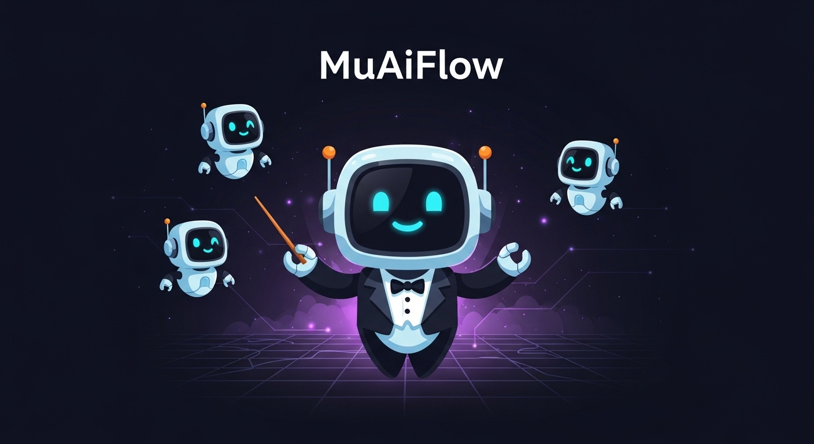

# MuAiFlow — Multi-AI Workflow

<p align="center">
  
</p>

> A structured workflow for collaborating with multiple AI agents on software projects, with mandatory cross-review and a **human-in-the-loop** approval gate before execution.

[](LICENSE)
[](CONTRIBUTING.md)

---

## Why MuAiFlow?

If you've been vibe-coding with AI agents, you've probably hit this wall: you generate a plan with one AI, then manually copy-paste it into another AI for validation, then go back to execute. **You become the middleware** — the human glue between tools that should talk to each other.

MuAiFlow was born from this exact frustration. Instead of bouncing between tools and burning tokens on copy-paste workflows, it gives you a **file-based protocol** that any AI can read and follow. The plan lives in a Markdown file with structured frontmatter. Any AI that can read files can participate — plan, review, or execute — without you manually transferring context.

### The core idea

- **One AI plans** → **A different AI reviews** → **Human approves** → **AI executes**

Plans get better when a second AI challenges them before code is written. Edge cases surface. Architectural risks get caught. And you stay in control — no AI can execute without your explicit approval.

### The real-world problem it solves

Most developers using AI coding agents face a token budget reality: some tools have generous limits (like Codex CLI), while others burn through tokens fast. MuAiFlow lets you be **strategic** — use your high-limit tool for planning and execution, and reserve your premium tool for the critical review step where its strengths matter most. The workflow adapts to your tools and budget, not the other way around.

---

## How It Works

```
[AI #1] Generate plan  →  status: DRAFT
        ↓
[AI #2] Cross-review   →  status: AI_REVIEWED
        ↓
⏸️  AI STOPS. Notifies human that plan is ready.
        ↓
[HUMAN] Approve plan   →  status: HUMAN_APPROVED  (only humans set this)
        ↓
[AI #1 or #2] Execute  →  status: EXECUTING → DONE
        ↓
[AI #2] Final code review  (optional)
```

**No AI can ever set `status: HUMAN_APPROVED`.** This is the core safety guarantee of MuAiFlow.

---

## Supported Tools

MuAiFlow is **tool-agnostic** — it works with any AI agent that can read files and follow instructions. You choose which AI is your primary planner, which one cross-reviews, and which one executes. There is no required combination.

Here are some examples, but you can use any AI tools in any role:

| Example setup | Planner     | Reviewer                 | Executor    |
| ------------- | ----------- | ------------------------ | ----------- |
| Codex-first   | Codex CLI   | Claude Code or Crush     | Codex CLI   |
| Claude-first  | Claude Code | Crush or Codex CLI       | Claude Code |
| Crush-first   | Crush       | Claude Code or Codex CLI | Crush       |

The only requirement is that **the reviewer must be a different AI than the planner** — the whole point is a second pair of eyes.

> **Note:** GitHub Copilot is assistive only (editor suggestions, PR review). It cannot plan, execute plans, or fill plan frontmatter.

---

## VS Code Extension — File Reference (`@`)

MuAiFlow includes a VS Code extension that lets you quickly reference project files inside `.md` plan files using `@path/to/file` syntax.

### How it works

- **Type `@` in any Markdown file** → a Quick Pick opens with all workspace files and folders, with a loading spinner while indexing
- **Press `Cmd+Alt+R`** (Mac) / `Ctrl+Alt+R` (Windows/Linux) → same Quick Pick, without typing `@` first
- **Select a file** → inserts `@path/to/file` at the cursor position
- The file list is **cached in memory** and refreshes automatically when files are created or deleted

### Install

```bash
bash install.sh
```

Or manually:

```bash
cd vscode-extension
npm install
npm run compile
vsce package --no-dependencies --allow-missing-repository
code --install-extension muaiflow-file-ref-*.vsix --force
```

After installing, **reload VS Code** (`Cmd+Shift+P` → "Reload Window").

### Configuration

| Setting                               | Default                                                                      | Description                                |
| ------------------------------------- | ---------------------------------------------------------------------------- | ------------------------------------------ |
| `muaiflow.fileRef.include`            | `**/*`                                                                       | Glob pattern for files to include          |
| `muaiflow.fileRef.exclude`            | `**/node_modules/**,**/.git/**,**/dist/**,**/out/**,**/.next/**,**/build/**` | Glob patterns to exclude (comma-separated) |
| `muaiflow.fileRef.includeDirectories` | `true`                                                                       | Include directories in suggestions         |

---

## Quick Start

### Install via package manager (recommended)

```bash
# pnpm
pnpm add -D muaiflow

# npm
npm install --save-dev muaiflow

# yarn
yarn add -D muaiflow
```

On install, MuAiFlow automatically copies the `.ai/` directory into your project. To update templates later:

```bash
pnpm update muaiflow
npx muaiflow init --force   # update .ai/ templates while preserving plans and context
```

Then add a project instruction file:

```bash
npx muaiflow examples       # copies AGENTS.md.example and CLAUDE.md.example
mv AGENTS.md.example AGENTS.md   # for Codex CLI
# or
mv CLAUDE.md.example CLAUDE.md   # for Claude Code
```

### CLI commands

```bash
npx muaiflow init [--force]             # Copy/update .ai/ while preserving plans and context
npx muaiflow plan <title> --tracked     # Create .ai/plans/tracked/YYYY-MM-DD-title.md
npx muaiflow plan <title> --local       # Create .ai/plans/local/YYYY-MM-DD-title.md
npx muaiflow context [--force]          # Create/reset .ai/plans/context.md
npx muaiflow examples                   # Copy example AGENTS.md and CLAUDE.md
npx muaiflow version                    # Show installed version
npx muaiflow help                       # Show help
```

### Install as Skill

Install individual workflow skills via [skills.sh](https://skills.sh):

```bash
npx skills add 4rweb/MuAiFlow --skill muai-workflow
npx skills add 4rweb/MuAiFlow --skill muai-plan-generator
npx skills add 4rweb/MuAiFlow --skill muai-cross-review
npx skills add 4rweb/MuAiFlow --skill muai-executor
npx skills add 4rweb/MuAiFlow --skill muai-handoff
npx skills add 4rweb/MuAiFlow --skill muai-code-review
npx skills add 4rweb/MuAiFlow --skill muai-smart-router

# List all available skills
npx skills add 4rweb/MuAiFlow --list
```

### Available Skills

| Skill | Description |
|-------|-------------|
| `muai-workflow` | Complete multi-AI workflow (plan → review → approve → execute) |
| `muai-plan-generator` | Generates structured implementation plans with tasks and dependencies |
| `muai-cross-review` | Reviews plans from another AI with evidence-based validation |
| `muai-executor` | Executes human-approved plans following dependency order |
| `muai-handoff` | Resumes work when switching between AI agents |
| `muai-code-review` | Final code review after plan execution |
| `muai-smart-router` | Routes tasks to optimal model tiers (reasoning/standard/fast) |

### Manual install (no package manager)

```bash
cp -r .ai/ /path/to/your-project/.ai/

# For Claude Code
cp examples/CLAUDE.md.example /path/to/your-project/CLAUDE.md

# For Codex CLI
cp examples/AGENTS.md.example /path/to/your-project/AGENTS.md
```

---

## Usage

### Prepare context (optional)

When your task involves large reference data (DB schemas, API payloads, business rules), put it in `.ai/plans/context.md` before running the plan command. The reusable skeleton lives at `.ai/plans/CONTEXT_TEMPLATE.md`.

```bash
npx muaiflow context          # create context.md if missing
npx muaiflow context --force  # reset context.md from CONTEXT_TEMPLATE.md
```

### Create your first plan

```bash
cd your-project

# Create a plan file
npx muaiflow plan my-feature --tracked   # .ai/plans/tracked/YYYY-MM-DD-my-feature.md
npx muaiflow plan my-feature --local     # .ai/plans/local/YYYY-MM-DD-my-feature.md

# Ask an AI to fill it in
# Codex:
codex "Follow .ai/prompts/plan-generation.prompt.md to fill .ai/plans/tracked/YYYY-MM-DD-my-feature.md with a plan to [describe your task]"

# Claude Code: type this message in the chat
"Follow .ai/prompts/plan-generation.prompt.md to fill .ai/plans/tracked/YYYY-MM-DD-my-feature.md with a plan to [describe your task]"
```

### Cross-review with another AI

```bash
# Claude Code (type in chat):
"Follow .ai/prompts/multi-ai-review.prompt.md to validate .ai/plans/tracked/YYYY-MM-DD-my-feature.md"

# Crush:
crush run "Follow .ai/prompts/multi-ai-review.prompt.md to validate .ai/plans/tracked/YYYY-MM-DD-my-feature.md"
```

### Approve (humans only)

Open the plan file and fill in the frontmatter:

```yaml
status: HUMAN_APPROVED
human_approved_by: your-name
human_approved_at: 2025-01-15T10:00:00-03:00
human_notes: looks good, go ahead
```

### Execute

```bash
codex "Follow .ai/prompts/execute-approved-plan.prompt.md to execute .ai/plans/tracked/YYYY-MM-DD-my-feature.md"
```

---

## Directory Structure

```
skills/                              # Installable via `npx skills add`
├── muai-workflow/SKILL.md           # Complete workflow
├── muai-plan-generator/SKILL.md     # Plan generation
├── muai-cross-review/SKILL.md       # Cross-review validation
├── muai-executor/SKILL.md           # Plan execution
├── muai-handoff/SKILL.md            # Handoff between AIs
├── muai-code-review/SKILL.md        # Final code review
└── muai-smart-router/SKILL.md       # Model tier routing

.ai/
├── README.md                        # Quick reference
├── SETUP.md                         # Full documentation
├── plans/
│   ├── TEMPLATE.md                  # Copy this for each new plan
│   ├── CONTEXT_TEMPLATE.md          # Reusable skeleton for context.md
│   ├── context.md                   # User working copy for large reference data
│   ├── tracked/
│   │   └── YYYY-MM-DD-feature-name.md  # Git-tracked plans
│   └── local/
│       └── YYYY-MM-DD-feature-name.md  # Git-ignored local plans
├── prompts/
│   ├── plan-generation.prompt.md    # Instruct AI to generate a plan
│   ├── multi-ai-review.prompt.md    # Instruct AI to cross-review a plan
│   ├── execute-approved-plan.prompt.md  # Instruct AI to execute
│   ├── handoff-resume.prompt.md     # Resume work from another AI
│   └── final-code-review.prompt.md  # Optional post-execution review
└── scripts/
    └── handoff.sh                   # Capture context when switching AIs

vscode-extension/
├── src/extension.ts                 # Extension source (TypeScript)
├── package.json                     # Manifest, commands, keybindings, config
└── tsconfig.json

install.sh                           # Installs the .vsix extension via `code` CLI
muaiflow-file-ref.vsix               # Pre-built extension package
```

---

## Plan Status Flow

```
DRAFT → AI_REVIEWED → HUMAN_APPROVED → EXECUTING → DONE
          ↓                                ↓
   CHANGES_REQUESTED                   BLOCKED
          ↓
       AI_REVIEWED
```

| Status              | Who sets it            |
| ------------------- | ---------------------- |
| `DRAFT`             | AI that wrote the plan |
| `AI_REVIEWED`       | Reviewing AI           |
| `CHANGES_REQUESTED` | Reviewing AI           |
| `HUMAN_APPROVED`    | ⚠️ **Human only**      |
| `EXECUTING`         | Executing AI           |
| `BLOCKED`           | Executing AI           |
| `DONE`              | Executing AI           |

---

## When is cross-review required?

| Condition                                    | Required?   |
| -------------------------------------------- | ----------- |
| Database migrations or schema changes        | ✅ Required |
| Authentication / authorization / permissions | ✅ Required |
| External API integrations                    | ✅ Required |
| Refactor touching > 5 files                  | ✅ Required |
| Changes across multiple apps/services        | ✅ Required |
| AI taking over execution from another AI     | ✅ Required |
| Docs, small tweaks (< 3 files), chores       | Optional    |

---

## Switching AIs mid-task (handoff)

If an AI runs out of tokens or you want to switch tools:

```bash
# Before switching, generate a snapshot
bash .ai/scripts/handoff.sh codex

# The next AI resumes with:
"Follow .ai/prompts/handoff-resume.prompt.md to resume the plan path reported by handoff.sh"
```

---

## Token Strategy — Getting the Most from Your Tools

MuAiFlow is designed to let you allocate each task to the tool where it makes the most sense — both in quality and cost. Here's a practical guide:

| Task                        | Best tool for                                     | Why                                                                                                          |
| --------------------------- | ------------------------------------------------- | ------------------------------------------------------------------------------------------------------------ |
| **Planning**                | Your highest-limit tool (e.g. Codex CLI)          | Plans are token-heavy — generation + iteration. Use the tool where tokens are cheap or unlimited.            |
| **Cross-review**            | Your strongest reasoning tool (e.g. Claude, Opus) | Reviews are short but high-value. This is where catching a subtle bug saves hours. Worth the premium tokens. |
| **Execution**               | Your highest-limit tool (e.g. Codex CLI)          | Execution is the most token-intensive phase. Use the tool with the deepest budget.                           |
| **Debugging hard problems** | Your strongest reasoning tool                     | When you're truly stuck, a fresh perspective from a stronger model pays for itself.                          |

### Example: maximizing a limited Claude budget

If your Claude Code tokens run out fast but Codex CLI has generous limits:

```
Codex  → generate plan        (token-heavy, Codex handles it)
Claude → cross-review only    (short, surgical, high-value)
Codex  → execute the plan     (most tokens spent here)
Claude → only when stuck on a hard bug or architectural decision
```

This way Claude is reserved for what it does best — critical review and complex reasoning — while Codex handles the volume work. Your Claude budget lasts the whole week instead of one day.

The beauty of MuAiFlow is that **the workflow doesn't change** regardless of which tools you pick. The `.ai/plans/` file is the contract — any AI that reads files can participate.

### Smart Model Routing

Each task in a MuAiFlow plan can specify a **model tier** — so you don't waste your strongest (most expensive) model on mechanical work:

| Tier        | Use for                           | Example                |
| ----------- | --------------------------------- | ---------------------- |
| `reasoning` | Architecture, debugging, security | Design auth flow       |
| `standard`  | Business logic, endpoints         | Implement CRUD service |
| `fast`      | Boilerplate, tests, styles, docs  | Generate i18n file     |

Install the routing skill: `npx skills add 4rweb/MuAiFlow --skill muai-smart-router`

### Token Optimization

MuAiFlow includes a complete guide to reducing token waste — from auditing auto-loaded context files to optimizing hooks. See `.ai/SETUP.md` → **Token Optimization**.

### Orchestration Patterns

Beyond the basic plan→review→execute flow, MuAiFlow documents 5 orchestration patterns for connecting multiple AIs: file-based handoff, MCP bridge, CLI delegation, parallel execution with git worktrees, and brain+hands split. See `.ai/SETUP.md` → **Orchestration Patterns**.

---

## Contributing

See [CONTRIBUTING.md](CONTRIBUTING.md).

---

## License

MIT — see [LICENSE](LICENSE).
